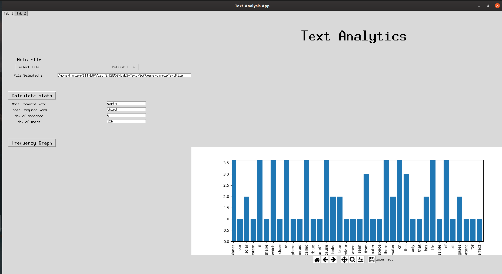
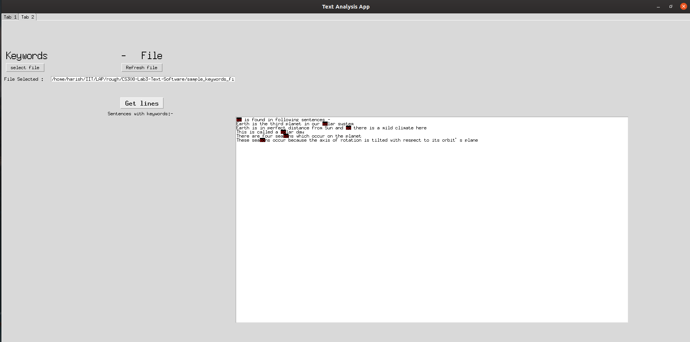

# Frontend Documentation

A text analysis and plotting tool

## Credits

The Frontend is maintained and developed by Harish Jaglan(B18115) and Ujjwal Soni (B18031)

## Functions

- Enabling the user to easily surf through the rich array of functionalities provided by the backend and API
- Tinker based easy to understand and implement bug free Graphical User Interface.
- Two different tabs for:
  - To view quick analysis of data along with graphs (Tab1)
  - To view the lines containing required words list passed by the user (Tab2)

## Environment 

The implementation has been done in Python 3, with Tkinter.

## Tab1

- Main file
  - Select File Button : This Button lets you select the text file form the file explorer. 
  - Refresh File Button : This button when clicked software loads the modified file and provide the updated statistics. 
  
- Calculate Stats Button : This button when clicked provides the following statistics:
  - Most Frequent Word : This label shows the most frequent word in the text file.
  - Least Frequent Word : This label shows the least frequent word in the text file.
  - Number of sentences : This label shows the total number of sentences in the text file.
  - Number of words : This label shows the total number of words in the text file.
  
- Frequency Graph Button : This button when clicked it shows the histogram of the various words in the text file. Basically the histogram shows the frequency of the words in the Y-axis given the word in X-axis. 
  
## Tab2

- Keywords file
  - Select File Button : This Button lets you select the text file form the file explorer. 
  - Refresh File Button : This button when clicked software loads the modified file and provide the updated statistics.
  - Get Lines Button: This button when clicked the software extracts all the sentences containing the keywords and display those secntences in the gui.
 

